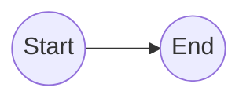
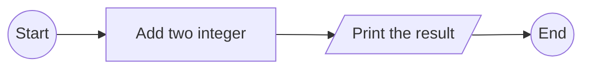
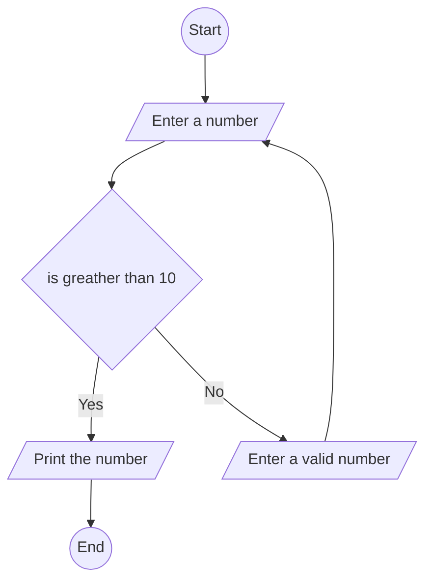

# Essential Flowchart Nodes and Their Corresponding Mermaid Notations

# Mermaid
Diagramming and Charting tool that lets you create diagrams and visualizations using text and code. This tool makes creating diagrams and charts simple!

## Flow Chart 
**Short Answer**: Visualizing algorithms
**Answer**: *Visualizing algorithms* uses diagrams with shapes (nodes) and arrows (edges) to show the steps and decisions involved in a computer program. 
### Start/End 
Ovals represent the program's start and end in flowcharts. Mermaid uses `(())` syntax for ovals.

```code
---
Start/End
---
flowchart LR
A((Start))
B(( End ))

A --> B
```



### Process
Processes (actions/tasks) are rectangles in flowcharts. Use `[[]]` syntax for rectangles in Mermaid.

```code
---
Process
---
flowchart LR
A((Start))
B((End))
C[Add two integer]
D[/Print the result/]

A --> C
C --> D
D --> B

```


### Decision
Decisions (e.g., user input > 10) are diamonds in flowcharts. Use `{}` for diamonds in Mermaid.

```code
---
Decision
---
flowchart TB
A((Start))
B((End))
C[/Enter a number/]
D{is greather than 10}
E[/Print the number/]
F[/Enter a valid number/]

A --> C
C --> D
D --> |Yes|E
D --> |No|F
F --> C
E --> B

```



### Input/Output
Input/output operations are parallelograms in flowcharts. Use `[//]` for them in Mermaid.
